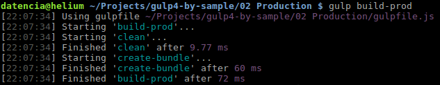
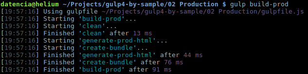
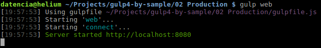
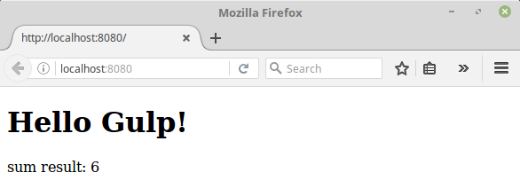

# 02 Production

In this sample we are going to create a production ready package, we will
concatenate all javascript files into a single bundle file, then minify it and
update the script references on the generated `index.html`.

We will use the previous sample **01 Dist** as the starting point.

Summary steps:

- Install a file concat plugin.
- Install an uglify plugin.
- Configure the concat/uglify plugins in gulpfile.js.
- Create a copy-html task.
- Install a process html plugin.
- Check that all is running smoothly.

# Steps to build it

## Prerequisites

Same as on **01 Dist** sample.

## Steps

- Install `gulp-concat` and `gulp-uglify`, a file concat plugin and an uglify
plugin for gulp.

 ```bash
 $ npm install gulp-concat --save-dev
 $ npm install gulp-uglify --save-dev
 ```

- Require these plugins in our `gulpfile.js`.

 ```javascript
 var gulp = require('gulp'),
     connect = require('gulp-connect'),
     del = require('del'),
     concat = require('gulp-concat'),
     uglify = require('gulp-uglify');
 ...
 ```

- Create a new gulp task named `create-bundle`. This task will performs the next operations:
 - Concat all the javascript files under the src folder into one single file.
 - Uglify the result javascript file.
 - Store the uglify file in a new folder named dist.

 ```javascript
 gulp.task('create-bundle', function() {
   return gulp.src('./src/**/*.js')
              .pipe(concat('app.min.js'))
              .pipe(gulp.dest('dist'))
              .pipe(uglify())
              .pipe(gulp.dest('dist'));
 });
 ```

- Add a new task called `build-prod`, this task needs to executes sequentially
the tasks `clean` and `create-bundle`, in this order. We can do this with the new
[gulp.series](https://gulp.readme.io/docs/gulpseriestasks) method added in
gulp 4.0 beta.

 ```javascript
 gulp.task('build-prod', gulp.series('clean', 'create-bundle'));
 ```

- Right now we can make a quick check point and ensure we only have the minified
javascript file on our dist folder.

 ```bash
 $ gulp build-prod
 ```

 

- Still we have work to do... the HTML file on the dist folder is gone
(we are not calling the copy task), and what's worse there are script tags under
this HTML pointing to the non minifed versions of the javascript files. In order
to solve this issue we are going install a new plugin.

 ```bash
 $ npm install gulp-html-replace --save-dev
 ```

 This plugins allows us to replace script tags by marking commented areas in the main HTML.

- Add the next commented markup to the index.html file, just under the h1 tag.

 ```html
 <!-- build:js -->
 <script src="./calculator.js"></script>
 <script src="./main.js"></script>  
 <!-- endbuild -->
 ```

- Jump into the `gulpfile.js` file to register the plugin:

 ```javascript
 var gulp = require('gulp'),
     connect = require('gulp-connect'),
     del = require('del'),
     concat = require('gulp-concat'),
     uglify = require('gulp-uglify'),
     htmlreplace = require('gulp-html-replace');
 ...
 ```

- Configure it.

 ```javascript
 gulp.task('generate-prod-html', function() {
   return gulp.src('./src/index.html')
              .pipe(htmlreplace({
                'js': '<script src="app.min.js"></script>'
              }))
              .pipe(gulp.dest('./dist'));
 });
 ```

- And add it to the `build-prod` process.

 ```javascript
 gulp.task('build-prod', gulp.series('clean', gulp.parallel('generate-prod-html', 'create-bundle')));
 ```

 > Note here that we are using the [gulp.parallel](https://gulp.readme.io/docs/gulpparalleltasks)
 method added in gulp 4.0 beta.
 This method executes the tasks defined in parallel, all being executed at the same time.

- Now we can test it and check that everything is working as expected.
Run the build process with the next command:

 ```bash
 $ gulp build-prod
 ```

 

- Run the app with the following command:

 ```bash
 $ gulp web
 ```

 

- Then, load http://localhost:8080/ in a browser to see the output.

 
