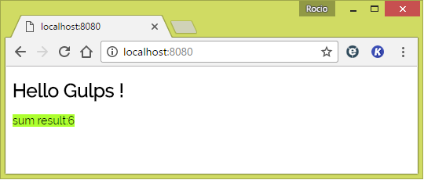
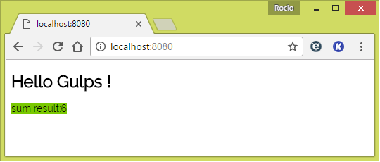
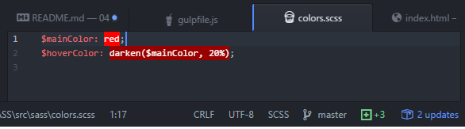
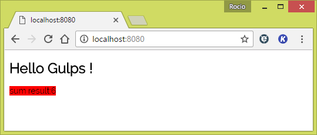

# 04 SASS

This sample takes as starting point _03 LifeReload_.

In this sample we are going to add SASS in a production ready package. We will build css from SASS (using gulp) and concatenate all js in a single bundle file, then minify it and update then script references and the new css on the generated index.html

Summary steps:

- Let's install a file concat plugin
- Let's install an uglify  plugin.
- Let's install an html-replace  plugin.
- Let's install an sass  plugin.
- Let's configure all plugins in gulpfile.js.
- Let's check that all is running smoothly.


# Steps to build it

##Prerequisites

Same as on _00 Connect_ sample. Remember, you must install Node.js and npm (v6.7.0):
```
npm install gulpjs/gulp#4.0 --save-dev
```

And also connect plugin:
```
npm install gulp-connect --save-dev
```

##Steps

- Let's install a file concat plugin.

```
npm install gulp-concat --save-dev
```

- Let's install a uglify plugin.

```
npm install gulp-uglify --save-dev
```

- Let's install an html-replace  plugin.

```
npm install gulp-html-replace --save-dev
```

- Let's install an sass  plugin.

```
npm install gulp-sass --save-dev
```

- Let's configure all plugins in gulpfile.js.

  - Like *sample 00* we must create a connect task

  ```
  gulp.task('connect', function() {
  connect.server({
      root: 'dist',
      livereload: true
  });
});
```

  - Next step: We are going to remember how create a clean task

  ```
  gulp.task('clean', function() {
     return del([
         'dist/**/*'
       ]);
   });
   ```

  - Remembering a copy-dev task

  ```
  gulp.task('copy-dev', function() {
    return   gulp.src('./src/**/*')
               .pipe(gulp.dest('./dist')
             );
             });

  ```

  - Adding force-reload task

  ```
  gulp.task('force-reload', function() {
    return   gulp.src('./src/*.html')
               .pipe(connect.reload());
  });

  ```
  - Adding a sass task

  ```
  gulp.task('sass', function () {
  return gulp.src('./src/sass/**/*.scss')
    .pipe(sass().on('error', sass.logError))
    .pipe(gulp.dest('./dist'));
});
  ```
  - Adding a generate-prod-js-html task

  ```
    gulp.task('generate-prod-js-html', function() {
        return   gulp.src('./src/index.html')
             .pipe(htmlreplace({
               'js': '<script src="app.min.js"></script>',
             }))
             .pipe(gulp.dest('./dist')
           );
            });
  ```

  - Remembering a watch task and adding minor changes: add css

  ```
  gulp.task('watch', function() {
  gulp.watch(['./src/**/*.html', './src/**/*.js', './src/sass/**/*.scss'], gulp.series('build-dev', 'force-reload'))
});
  ```
  - Remembering a build-dev task and also adding minor changes: add the sass task

  ```
  gulp.task('build-dev', gulp.series(
          'clean', 'copy-dev', 'sass',
          gulp.parallel('generate-prod-js-html','create-bundle-js')));
  ```


- Now, let's check that all is running smoothly.

First we must add a web task or default task
```
gulp.task('web', gulp.parallel('connect', 'watch'));
gulp.task('default', gulp.series('web'));
```

Now, we can test it and check that everything is working as expected

  - open the browser

  

  - Hover the result text and we can see other style that we definied in colors.scss

  

  - now we can edit colors.scss and save it

    

  - the browser will be refresh automatically

  
