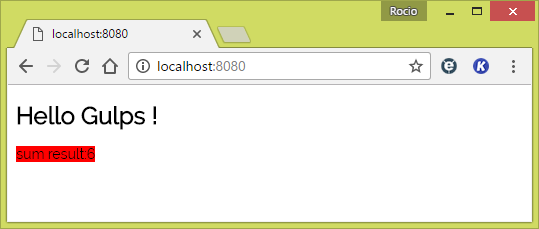

# 05 CSSMinify

This sample takes as starting point _04 SASS_.

In this sample we are going to minify the CSS finals for use in production. We will build css from SASS (using gulp) and minify new css generated.

##Steps

- Let's install `gulp-clean-css` to minify CSS.

```
npm install gulp-clean-css --save-dev
```

- Let's install a `gulp-sourcemaps` plugin because it's not easy debugging the final CSS minified:

```
npm install gulp-sourcemaps --save-dev
```

- Let's use gulp-clean-css and gulp-sourcemaps in gulpfile.js:

  - Add the following code in the beginning of _gulpfile.js_:

    ```javascript
    var sourcemaps = require('gulp-sourcemaps');
    var cleanCSS   = require('gulp-clean-css');

    ```  

  - Next step: We are going to use `gulp-sourcemaps` and `gulp-clean-css` in the sass task:

    ```
    gulp.task('sass', function () {
      return gulp.src('./src/sass/**/*.scss')
        .pipe(sourcemaps.init())
        .pipe(sass().on('error', sass.logError))
        .pipe(cleanCSS({compatibility: 'ie8'}))
        .pipe(sourcemaps.write())
        .pipe(gulp.dest('./dist'));
    });
    ```

- Let's check that all is running smoothly!

  ```
  gulp build-dev
  ```

Now, we can test it and check that everything is working as expected

  - open the browser

  

  - Hover the result text and we can see other style that we definied in colors.scss

  

  - now we can edit colors.scss and save it

    

  - the browser will be refresh automatically

  

  - _main.css_ should by minified and it should have a sourcemap line at the end.

  
